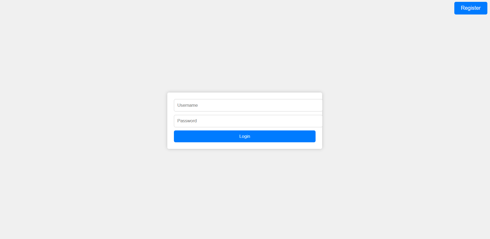
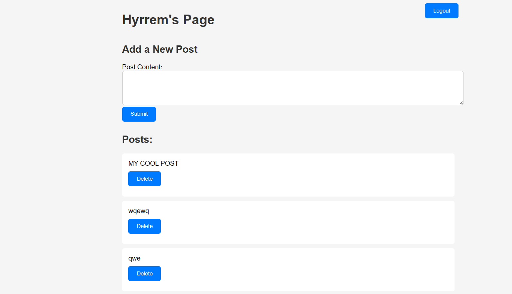
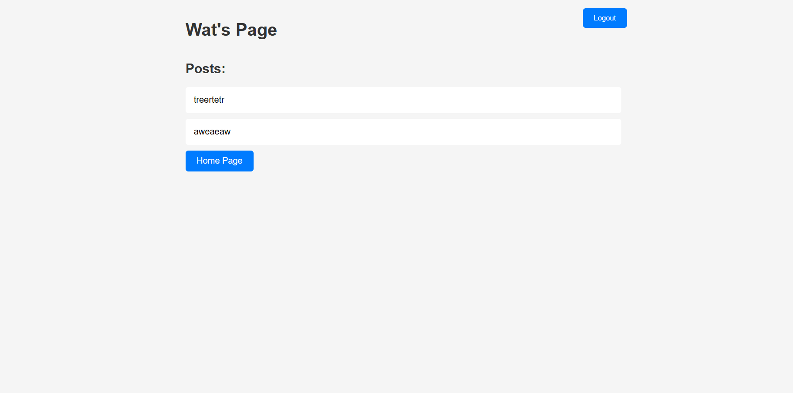
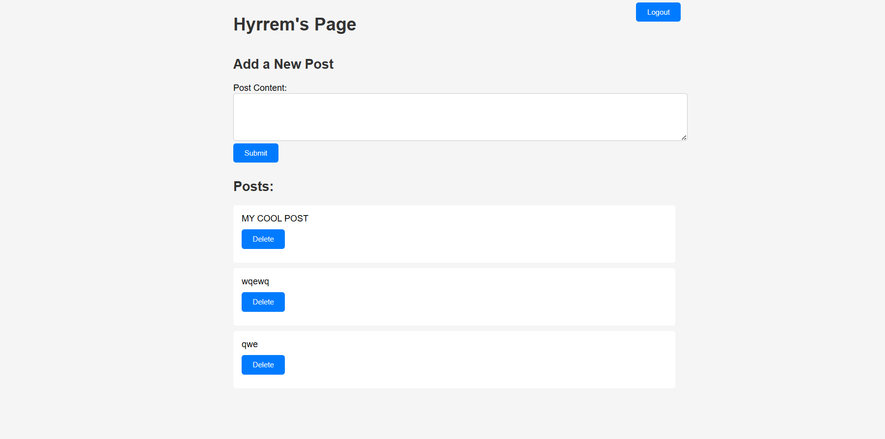
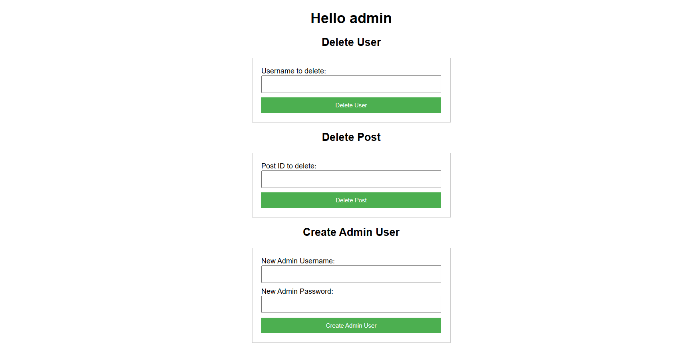

# Инструкция по запуску проекта

Данный проект представляет собой простую веб-страницу для управления постами пользователей. Для запуска проекта необходимо наличие веб-сервера с поддержкой PHP и базы данных PostgreSQL с таблицами `posts` и `users`, имеющими следующую структуру:

## Таблица `posts`
- `post_id` SERIAL (Primary Key)
- `user_id` INTEGER (Foreign Key to `users.id`)
- `post_content` TEXT
- `post_date` TIMESTAMP (Default CURRENT_TIMESTAMP)

## Таблица `users`
- `id` SERIAL (Primary Key)
- `login` VARCHAR(255)
- `password` VARCHAR(255) (hashed password)
- `role` VARCHAR(50)

## Инструкции по запуску:

1. **Настройка базы данных:**
   - Создайте базу данных PostgreSQL с указанными выше таблицами.
   - Убедитесь, что ваши настройки базы данных (хост, имя пользователя, пароль, имя базы данных) указаны в файле `DataService.php`.

2. **Размещение проекта:**
   - Разместите все файлы проекта на вашем веб-сервере в доступной для работы с PHP директории.

3. **Запуск приложения:**
   - Откройте веб-браузер и перейдите по адресу, соответствующему расположению проекта на вашем веб-сервере.
4. **Аутентификация:**
   - При первом запуске проекта вы будете перенаправлены на страницу `login.php`, где необходимо ввести данные для входа.

5. **Использование:**
   - После успешной аутентификации вы будете перенаправлены на страницу управления постами.
   - Здесь вы можете добавлять новые посты, просматривать и удалять свои посты.
   
   - Если вы введете в URL имя пользователя, отличное от вашего, вы увидите только его посты (если таковые имеются).

6. **Выход:**
   - Для выхода из учетной записи нажмите кнопку "Logout".

Веб-приложение разработано в рамках лабораторной работы "Практическая часть" и содержит следующие компоненты:

1. **Общедоступный компонент:**
   - Доступен для всех пользователей.
   - Генерирует динамический контент с использованием серверных скриптов и данных из базы данных.
   - Включает форму для сбора данных и форму для поиска в базе данных.

2. **Компонент с защищенным доступом:**
   - Доступ к нему защищен аутентификацией.
   - Для этого компонента определена роль "администратора".
   - Администратор имеет доступ к дополнительным функциям, таким как управление данными в базе данных.
   